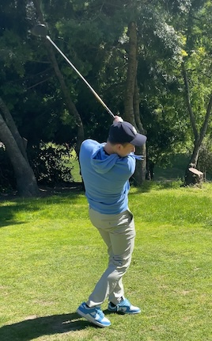

[*<< go back*](index.md)

  

Hello! My name is Benjamin Kramer, and I am an undergraduate at Case Western Reserve University (CWRU) studying mathematics and computer science. I'm from the Bay Area, however have resided in Cleveland the past few years. 

My research and academic interests lie in the computational biological, medical, and health sciences. My current subfields of interest are dynamical systems modeling and genomic or health record analysis through algorithms, statistical regression, and machine learning.

My non-academic interests include playing golf, running, tennis, chess, and Go. I also enjoy reading philosophy, particularly relating to Aristotelianism and Kant and have an interest in Classical Greece, Rome and the Byzantine Empire. 

**Previous research and academic experience includes...**
- The <a class="about-link" href="https://physiology.case.edu/" target="_blank">CWRU Department of Physiology and Biophysics</a> with <a class="about-link" href="https://publichealth.berkeley.edu/people/misbath-daouda" target="_blank">Dr. Agustin Gonzalez-Vicente</a> focusing on the renal system through experiments and bioinformatics. My first [publication](publications) and abstracts are related to this work.
- The <a class="about-link" href="https://publichealth.berkeley.edu/" target="_blank">UC Berkeley Department of Public Health</a> during an REU with <a class="about-link" href="https://publichealth.berkeley.edu/people/misbath-daouda" target="_blank">Professor Misbath Daouda</a>. I analyzed air pollution through satellite data in West Africa, using statistical modelling through Python, with all original visualizations [here](assets/items/BenjaminKramerBerkeleyPresentation2024.pptx).
- Different <a class="about-link" href="https://case.edu/" target="_blank">CWRU Departments</a> as a teaching assistant for [a few memorable courses](teaching), with multiple outside my specialization. Giving lectures recitations for thermodynamics greatly increased by fondness for physics!

**Non-academic job experience includes...**
- <a class="about-link" href="https://newsunroad.com/" target="_blank">New Sun Road</a> for two summers, a startup out of <a class="about-link" href="https://erg.berkeley.edu/" target="_blank">UC Berkeley's ERG</a>. I performed hardware/software QC on the StellarEdge Internet of Things (IoT) controller and contributed to light development to the StellarEdge's display board firmware.
- <a class="about-link" href="https://www.oaklandca.gov/" target="_blank">The City of Oakland</a>, in particular District 4 (West + Downtown Oakland). I created district databases for locations, requests, and solicitations in Python and performed policy analysis on revenue generated by Measure HH's Sugar Sweetened Beverage Distribution Tax.

